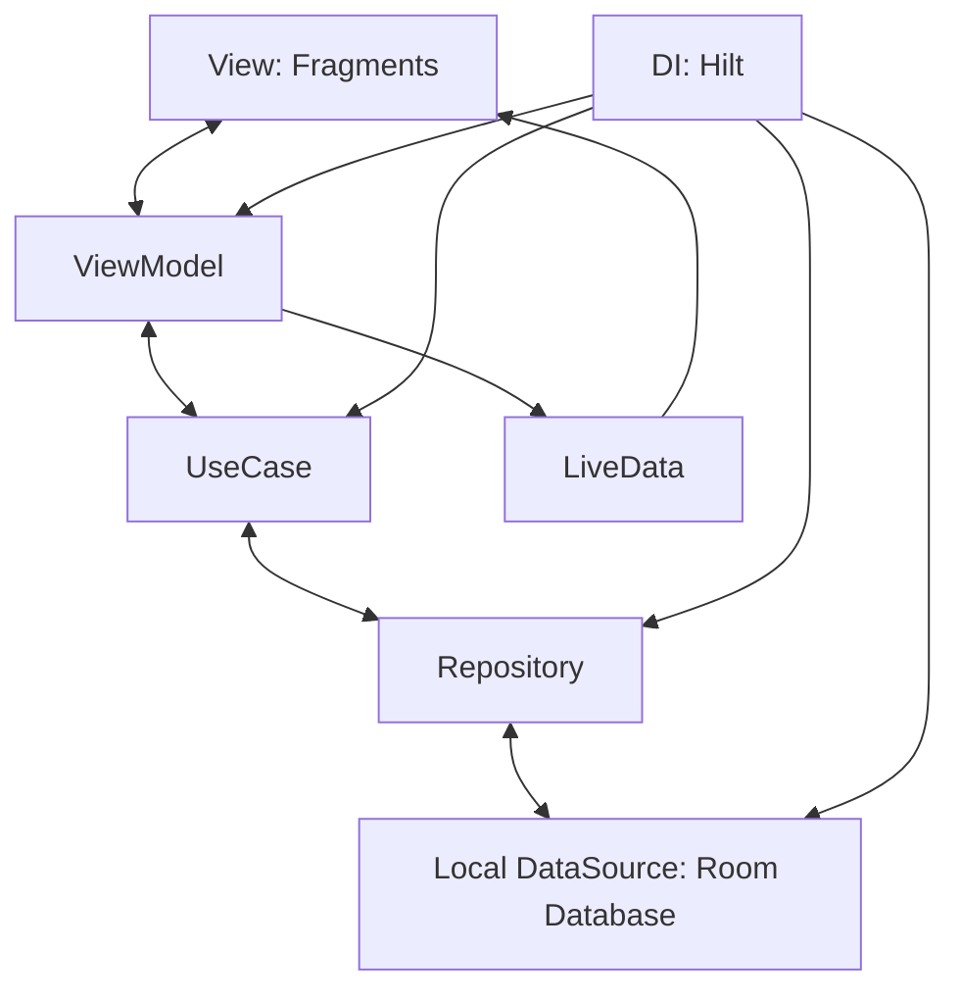
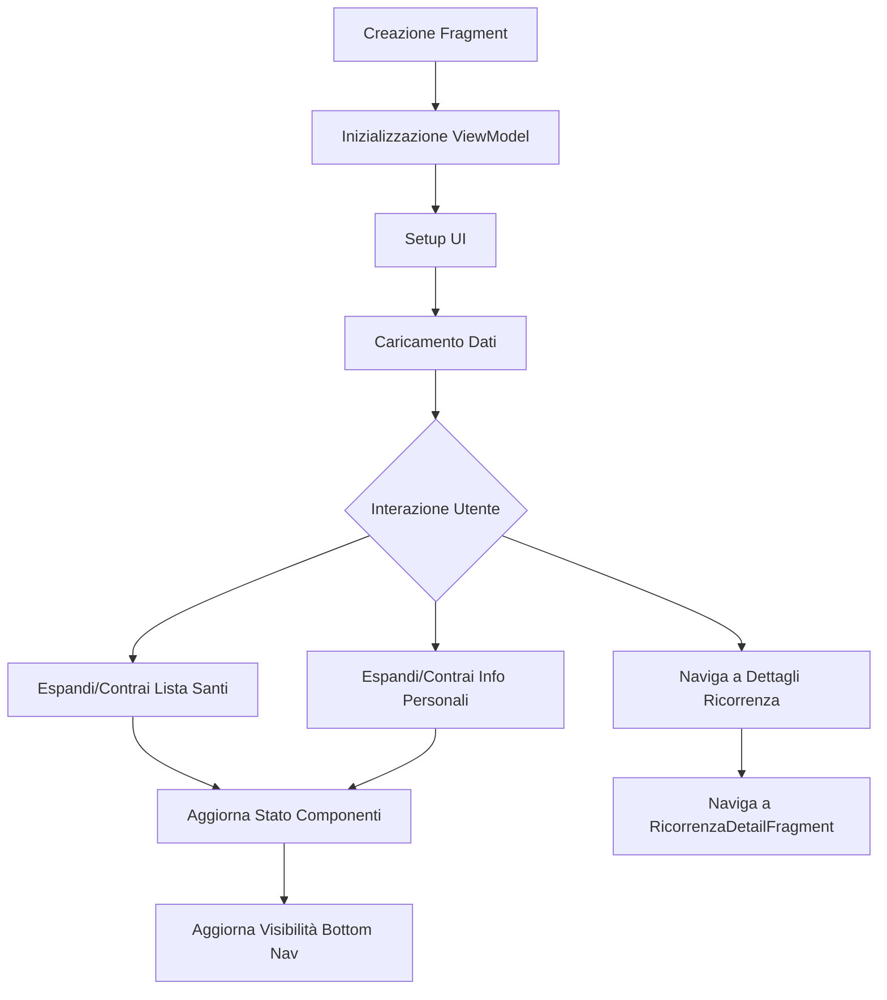
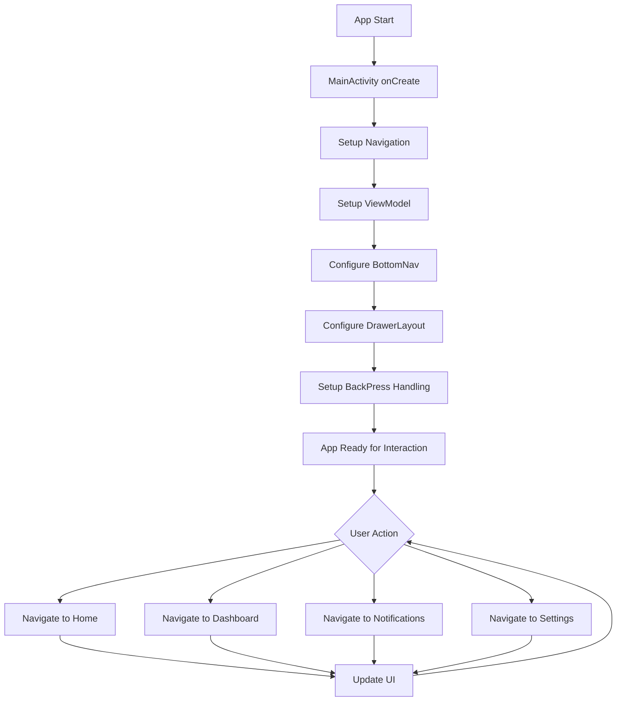
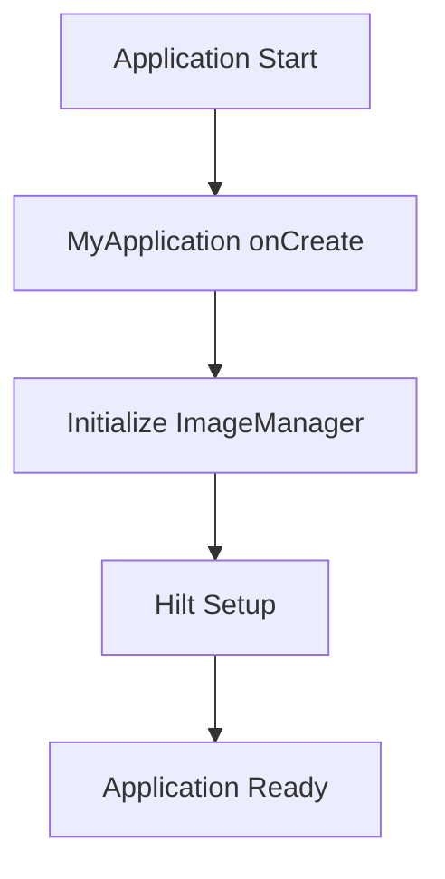
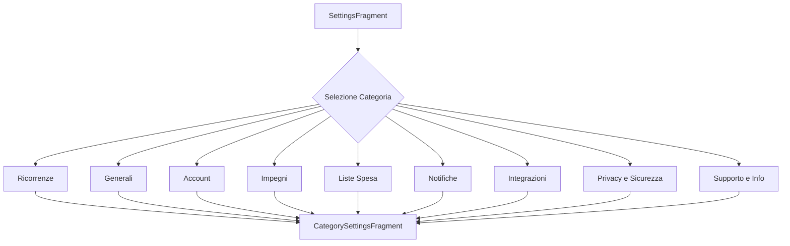
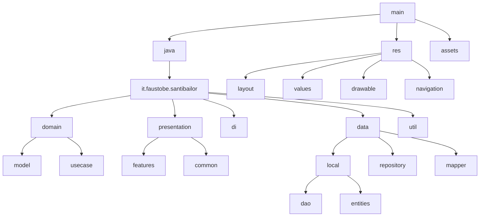
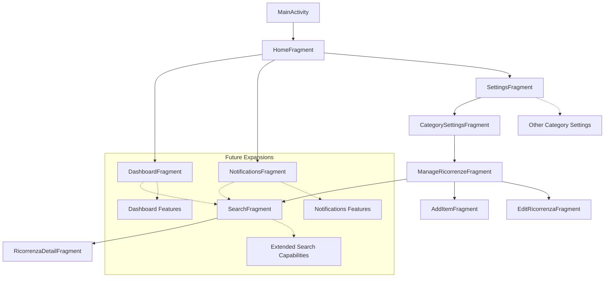
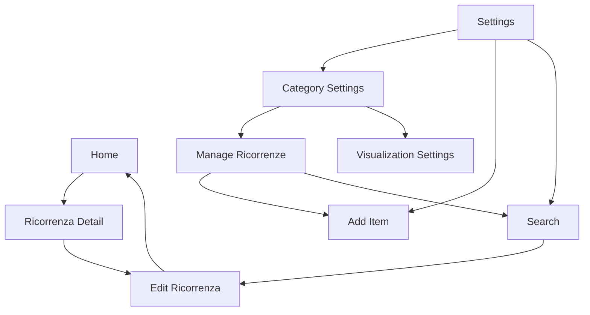

# SantiBailor - Documentazione del Progetto

Benvenuti nella documentazione ufficiale del progetto SantiBailor, un'applicazione Android per la gestione di ricorrenze, santi, impegni personali e liste della spesa.

## 📋 Aggiornamenti Recenti

### Sessione di Sviluppo: 6 Luglio 2026 (3) — Backup e Ripristino

**Export/import dei dati utente in JSON**

- **`BackupManager`** (`data/backup/`): esporta impegni, note, liste della spesa (con item),
  prodotti frequenti e ricorrenze non religiose (laiche/personali — i santi sono precaricati)
  in un file JSON versionato, tramite Storage Access Framework (nessun permesso storage).
- **Ripristino sostitutivo**: i dati utente correnti vengono eliminati e rimpiazzati in
  un'unica transazione Room; gli id vengono riassegnati (con remap lista→item) per evitare
  collisioni con l'autoincrement e con i santi precaricati. Dopo il restore i promemoria
  impegni vengono cancellati e rischedulati sui nuovi dati.
- **UI**: nuove voci "Backup dei dati" e "Ripristina backup" in Impostazioni → Privacy e Dati,
  con dialog di conferma (il restore non è annullabile).
- Nuovi metodi DAO di lettura sync/cancellazione totale (nessun cambio di schema, versione DB
  invariata a 11).
- Nota per la release: con `minifyEnabled true` servono regole ProGuard che preservino le
  entity Room usate da Gson via reflection.

### Sessione di Sviluppo: 6 Luglio 2026 (2) — Notifiche Impegni

**Sistema promemoria impegni completo**

- **Fix critico WorkManager**: l'inizializzazione manuale non passava la `HiltWorkerFactory`,
  quindi i worker `@HiltWorker` (incluso `DailySaintNotificationWorker`) non potevano essere
  istanziati. Ora la factory è iniettata in `MyApplication`.
- **`ImpegnoReminderWorker`**: nuovo worker che mostra la notifica di promemoria per un impegno;
  verifica le preferenze e lo stato dell'impegno al momento del fire (toggle nelle impostazioni
  efficace anche sui promemoria già schedulati).
- **Scheduling**: `WorkManagerHelper.scheduleImpegnoReminder/cancelImpegnoReminder`
  (OneTimeWorkRequest unico per impegno, policy REPLACE). `ImpegnoRepository` riallinea la
  schedulazione a ogni scrittura (insert/update/delete/completato) e all'avvio dell'app
  (`rescheduleAllReminders`).
- **`NotificationsFragment` reale**: la schermata "Promemoria" elenca gli impegni futuri con
  reminder attivo (orario del promemoria incluso), con empty state e banner se le notifiche
  sono disattivate; tap su un promemoria apre la modifica dell'impegno. Raggiungibile dal
  drawer (nuovo `drawer_menu.xml`).
- **Icona notifiche personalizzata** (`ic_notification`, campanella) al posto di
  `ic_launcher_foreground`; nuovo canale notifiche "Promemoria Impegni" (IMPORTANCE_HIGH).

### Sessione di Sviluppo: 6 Luglio 2026 (1)

**Pulizia codice e completamento feature note**

- Rimosso `TestFragment` (fragment di sviluppo) dal nav graph e dal codice.
- `HomeFragment`: eliminati tutti i blocchi di codice morto commentato (nav bar verticale,
  taccuino, card personal info, card liste spesa, animazioni calendario obsolete) e i campi/import
  ormai inutilizzati; il file è passato da ~1150 a ~750 righe senza cambi di comportamento.
- Note: implementato il menu contestuale su long-press (condividi / elimina con conferma),
  risolvendo il TODO in `NoteListFragment`; la data di modifica ora usa la risorsa `note_modified`
  invece di una stringa hardcoded.
- Roadmap sottostante aggiornata allo stato reale del progetto.

### Sessione di Sviluppo: 30 Dicembre 2025

**Implementazione Quick Actions nella Home**

È stata completata l'implementazione di un sistema di azioni rapide nella schermata Home con le seguenti funzionalità:

#### Funzionalità Implementate
1. **Calendario Collassabile Migliorato**
   - Calendario espanso all'apertura dell'app (vista riepilogo giornaliero)
   - Animazione fluida di riduzione del calendario con testo che si ridimensiona dinamicamente
   - Stato del calendario persistente durante la sessione (mantiene collapsed/expanded quando si naviga)
   - Reset automatico allo stato espanso alla chiusura/riapertura dell'app

2. **Quick Actions Buttons**
   - Quattro pulsanti azioni rapide visibili quando il calendario è collassato:
     * **Scrivi**: Navigazione rapida alle note/post-it
     * **Organizza**: Accesso veloce alla gestione impegni multipli
     * **Ricerca**: Ricerca globale nell'app
     * **Riepilogo**: Vista riepilogativa delle attività
   - Design coerente con Material Design 3
   - Integrati nell'animazione del MotionLayout

3. **Correzioni Tecniche**
   - Risolto conflitto tra listener multipli che causava stati inconsistenti
   - Implementato corretto aggiornamento delle dimensioni del testo quando lo stato viene ripristinato con `jumpToState()`
   - Aggiunto supporto MotionLayout per `card_liste_spesa` (precedentemente invisibile)
   - Rimossi metodi obsoleti che interferivano con la gestione dello stato

#### File Modificati
- `HomeFragment.java`: Gestione dello stato del calendario e animazioni
- `home_scene.xml`: Definizione degli stati expanded/collapsed nel MotionLayout
- `activity_main.xml`: Pulizia codice toolbar non utilizzata
- `dimens.xml`: Dimensioni ottimizzate per calendario collassato

## 🎯 Roadmap e Prossimi Step

### Completato
1. **Funzionalità Quick Actions** ✅
   - [x] Navigazione pulsante "Scrivi" verso sistema note/post-it (`NoteListFragment`/`NoteDetailFragment`)
   - [x] Vista "Organizza" per gestione rapida impegni multipli (`OrganizzaGiornataFragment`)
   - [x] Vista "Riepilogo" con dashboard attività giornaliere (`RiepilogoFragment`)
   - [x] Menu contestuale note (condividi / elimina)

2. **Localizzazione** ✅
   - [x] Traduzioni complete IT/EN (`values/` e `values-en/`)

3. **Sistema Notifiche Impegni** ✅
   - [x] Worker per reminder degli impegni (`ImpegnoReminderWorker`)
   - [x] Contenuto reale per `NotificationsFragment` (lista promemoria programmati)
   - [x] Icona notifiche personalizzata (`ic_notification`)
   - [x] Fix inizializzazione WorkManager con `HiltWorkerFactory`

### Priorità Media — Dati al sicuro
4. **Backup e Sincronizzazione**
   - [x] Export/Import dati in formato JSON (backup locale via SAF)
   - [ ] Estendere la sync Firebase oltre le ricorrenze (impegni, note, liste) — solo se
         la multi-device è un obiettivo: richiede gestione conflitti

### Priorità Media — Qualità e Rilascio
5. **Testing**
   - [ ] Unit test per ViewModel e UseCase principali
   - [ ] Test delle migration Room (il fallback distruttivo è volutamente disattivato)

6. **Preparazione Release**
   - [ ] `minifyEnabled true` con regole ProGuard verificate (Room, Hilt, Glide, Firebase)
   - [ ] Signing config e bump versione
   - [ ] Passata finale dark mode e accessibilità

### Priorità Bassa — UX e Funzionalità Nuove
7. **Miglioramenti UI/UX**
   - [ ] Gesture swipe per collapse/expand calendario
   - [ ] Feedback visivo/haptic ai pulsanti quick actions
   - [ ] Temi personalizzati

8. **Funzionalità Avanzate** (post-1.0)
   - [ ] Condivisione liste spesa tra utenti
   - [ ] Categorizzazione automatica articoli spesa
   - [ ] Integrazione calendario di sistema
   - [ ] Widget home screen
   - [ ] Sistema di tagging avanzato

### Note Tecniche
- **Architettura**: Mantenere coerenza con pattern MVVM attuale
- **Dipendenze**: Valutare aggiornamento a Jetpack Compose per nuove UI (lungo termine)
- **Compatibilità**: Supporto minimo Android 6.0 (API 23), target Android 14 (API 34)

## Introduzione al Progetto

SantiBailor è un'applicazione Android che offre agli utenti un modo semplice e intuitivo per gestire ricorrenze, tenere traccia di santi e festività, organizzare impegni personali e creare liste della spesa. L'applicazione è strutturata seguendo le best practices di sviluppo Android, utilizzando l'architettura MVVM (Model-View-ViewModel) e componenti moderni come Room per la persistenza dei dati.

## Indice della Documentazione

### 1. [Architettura](#architettura)
### 2. [Componenti Chiave](#componenti-chiave)
### 3. [Struttura del Progetto](#struttura-del-progetto)
### 4. [Navigazione](#navigazione)
### 5. [Gestione delle Immagini](#gestione-delle-immagini)
### 6. [Guida allo Sviluppo](#guida-allo-sviluppo)
### 7. [Manutenzione](#manutenzione)
### 8. [Checklist](#checklist)

## Architettura
<a name="architettura_componenti-architetturali"></a>

# Componenti Principali di SantiBailor

## 1. Domain
- **Model**: Contiene le classi di dominio come `Ricorrenza.java` e `TipoRicorrenza.java`.
- **UseCase**: Implementa la logica di business specifica, inclusi casi d'uso come `DeleteRicorrenzaUseCase`, `InsertRicorrenzaUseCase`, `GetRicorrenzeDelGiornoUseCase`, etc.

## 2. Presentation
- **Features**: Organizza l'UI in base alle funzionalità (ricorrenza, search, notifications, dashboard, main, settings).
- **Common**: Contiene componenti UI condivisi e ViewModel comuni.

## 3. Data
- **Local**: Gestisce la persistenza dei dati locali utilizzando Room.
  - **Dao**: Contiene le interfacce DAO per l'accesso ai dati (es. `RicorrenzaDao`, `TipoRicorrenzaDao`).
  - **Entities**: Definisce le entità del database (es. `RicorrenzaEntity`, `TipoRicorrenzaEntity`).
- **Repository**: Implementa il pattern Repository per l'accesso ai dati (es. `RicorrenzaRepository`).
- **Mapper**: Contiene classi per la mappatura tra entità di database e modelli di dominio.

## 4. DI (Dependency Injection)
- Contiene `AppModule.java` per la configurazione di Hilt.

## 5. Util
- Contiene classi di utilità come `DateUtils`, `ImageLoadingUtil`, `PaginationHelper`, etc.

## 6. Resources (res/)
- **Layout**: Definizioni XML per i layout dell'UI.
- **Values**: Risorse come stringhe, colori, dimensioni e temi.
- **Drawable**: Risorse grafiche e icone.
- **Navigation**: Definizione del grafo di navigazione.

## 7. Assets
- Contiene il database SQLite precaricato (`santocal.db`).

---

---

<a name="architettura_diagramma-mvvm"></a>
## Diagramma dell'Architettura MVVM



---

---


<a name="componenti-chiave"></a>
## Componenti Chiave

# Database

## Panoramica
Il database di SantiBailor è implementato utilizzando Room, la libreria di persistenza di Android Jetpack. Il database gestisce principalmente le ricorrenze (santi e festività) e le loro categorie.

## Struttura del Database

### Tabelle Principali
1. **santi**: Contiene i dati delle ricorrenze.
2. **tipo_ricorrenza**: Definisce i tipi di ricorrenze.
3. **mese**: Elenco dei mesi.
4. **giorno_d_settimana**: Elenco dei giorni della settimana (usato per l'UI).

### Schema della Tabella `santi`
```sql
CREATE TABLE IF NOT EXISTS "santi" (
    "id" INTEGER NOT NULL PRIMARY KEY,
    "id_mese" INTEGER NOT NULL,
    "giorno_del_mese" INTEGER NOT NULL,
    "santo" TEXT NOT NULL,
    "bio" TEXT,
    "image_url" TEXT,
    "prefix" TEXT,
    "suffix" TEXT,
    "id_tipo" INTEGER NOT NULL DEFAULT 1
);
```

### Schema della Tabella `tipo_ricorrenza`
```sql
CREATE TABLE IF NOT EXISTS "tipo_ricorrenza" (
    "id" INTEGER NOT NULL PRIMARY KEY,
    "tipo" TEXT NOT NULL
);
```

## Entità

### RicorrenzaEntity
Rappresenta una ricorrenza nel database.

Campi principali:
- `id`: Chiave primaria
- `idMese`: ID del mese
- `giornoDelMese`: Giorno del mese
- `nome`: Nome della ricorrenza
- `bio`: Biografia o descrizione
- `imageUrl`: URL dell'immagine associata
- `idTipo`: ID del tipo di ricorrenza

### TipoRicorrenzaEntity
Rappresenta un tipo di ricorrenza.

Campi:
- `id`: Chiave primaria
- `tipo`: Nome del tipo di ricorrenza

Costanti:
- `RELIGIOSA = 1`
- `LAICA = 2`

## Data Access Objects (DAO)

### RicorrenzaDao
Fornisce metodi per accedere e manipolare i dati delle ricorrenze.

Metodi principali:
- `getAllRicorrenze()`: Recupera tutte le ricorrenze.
- `getRicorrenzeDelGiorno(int giorno, int mese)`: Recupera le ricorrenze per una data specifica.
- `ricercaAvanzata(...)`: Esegue una ricerca avanzata con vari criteri.
- `ricercaAvanzataPaginata(...)`: Versione paginata della ricerca avanzata.

### TipoRicorrenzaDao
Gestisce l'accesso ai tipi di ricorrenza.

Metodi principali:
- `getAllTipiRicorrenza()`: Recupera tutti i tipi di ricorrenza.
- `getTipoRicorrenzaById(int id)`: Recupera un tipo di ricorrenza specifico.

## Migrazioni del Database
Il database è attualmente alla versione 5. Le migrazioni implementate includono:

1. MIGRATION_1_2: Ristrutturazione della tabella `santi`.
2. MIGRATION_2_3: Aggiornamento della versione senza modifiche strutturali.
3. MIGRATION_3_4: Aggiunta della colonna `image_url` se non presente.
4. MIGRATION_4_5: Verifica della struttura della tabella `santi`.

## Inizializzazione del Database
Il database viene inizializzato con dati preesistenti utilizzando un file di asset `santocal.db`.

```java
INSTANCE = Room.databaseBuilder(context.getApplicationContext(),
                AppDatabase.class, DATABASE_NAME)
        .createFromAsset(DATABASE_NAME)
        .addMigrations(MIGRATION_1_2, MIGRATION_2_3, MIGRATION_3_4, MIGRATION_4_5)
        .build();
```

## Considerazioni sulla Performance
- Utilizzo di query ottimizzate per la ricerca e il filtraggio.
- Implementazione di paginazione per gestire grandi set di dati.
- Uso di `LiveData` per osservare i cambiamenti nel database in modo reattivo.

## Best Practices Implementate
1. Separazione delle responsabilità tra entità, DAO e repository.
2. Uso di migrazioni per gestire le modifiche dello schema del database.
3. Implementazione di query complesse direttamente nel DAO per ottimizzare le prestazioni.
4. Utilizzo di `RawQuery` per query dinamiche complesse.

## Considerazioni per il Futuro
1. Implementare indici sulle colonne frequentemente utilizzate nelle query per migliorare le prestazioni.
2. Considerare l'uso di Foreign Keys per garantire l'integrità referenziale tra le tabelle.
3. Valutare l'implementazione di un meccanismo di caching per le query frequenti.
4. Monitorare le prestazioni delle query complesse e ottimizzarle se necessario.

---

---

<a name="componenti-chiave_home-fragment"></a>
## Home Fragment

## Panoramica
`HomeFragment` è il fragment principale dell'applicazione SantiBailor. Gestisce la visualizzazione della schermata home, che include la data corrente, il santo del giorno, una lista di santi, informazioni personali e una to-do list.

## Struttura e Organizzazione del Codice
La classe `HomeFragment` è situata nel package `it.faustobe.santibailor.presentation.features.home`. Estende `Fragment` e utilizza Hilt per la dependency injection.

## Funzionalità Principali
1. Visualizzazione della data corrente
2. Visualizzazione del santo del giorno
3. Gestione di una lista espandibile di santi
4. Visualizzazione e gestione di informazioni personali espandibili
5. Integrazione con `RicorrenzaViewModel` per la gestione dei dati
6. Navigazione verso i dettagli delle ricorrenze
7. Gestione della scrolling e visibilità del bottom navigation menu

## Dettagli Implementativi

### Classi e Interfacce Chiave
- `HomeFragment`: La classe principale del fragment
- `FragmentHomeBinding`: Classe di binding generata per il layout del fragment
- `RicorrenzaViewModel`: ViewModel per la gestione dei dati delle ricorrenze
- `HomeViewModel`: ViewModel specifico per la gestione dello stato della home
- `RicorrenzaAdapter`: Adapter per la lista dei santi

### Metodi Principali

#### `onCreateView()`
Inizializza il binding del layout.

#### `onViewCreated()`
Configura l'UI, inizializza i ViewModel e imposta i listener.

```java
@Override
public void onViewCreated(@NonNull View view, @Nullable Bundle savedInstanceState) {
    super.onViewCreated(view, savedInstanceState);
    ricorrenzaViewModel = new ViewModelProvider(requireActivity()).get(RicorrenzaViewModel.class);
    // ... (altre inizializzazioni)
    setupDateDisplay();
    loadBackgroundImage();
    setupSaintOfDay();
    setupPersonalInfo();
    setupSaintsList();
    // ... (altre configurazioni)
}
```

#### `setupSaintsList()`
Configura la RecyclerView per la lista dei santi e imposta l'observer per i dati delle ricorrenze.

#### `toggleSaintsListExpansion()`
Gestisce l'espansione e la contrazione della lista dei santi.

#### `setupPersonalInfoCard()`
Configura la card delle informazioni personali e gestisce la sua espansione/contrazione.

### Pattern di Progettazione Utilizzati
- **MVVM**: Utilizzo di ViewModel per separare la logica di business dalla UI.
- **Observer Pattern**: Utilizzo di LiveData per osservare cambiamenti nei ViewModel.
- **Adapter Pattern**: Utilizzo di RicorrenzaAdapter per la lista dei santi.

## Best Practices e Considerazioni
- Utilizzo di ViewBinding per un accesso type-safe alle view.
- Separazione delle responsabilità tra UI (Fragment) e logica di business (ViewModel).
- Gestione efficiente degli stati di espansione/contrazione per migliorare l'UX.
- Implementazione di animazioni smooth per le transizioni di visibilità.

## Interazioni con Altri Componenti
- **RicorrenzaViewModel**: Fornisce dati sulle ricorrenze e gestisce le operazioni CRUD.
- **HomeViewModel**: Gestisce lo stato specifico della home (es. espansione dei componenti).
- **MainActivity**: Interagisce per la gestione della visibilità del bottom navigation menu.

## Esempi di Codice
Esempio di gestione dell'espansione della lista dei santi:

```java
private void toggleSaintsListExpansion() {
    isSaintsListExpanded = !isSaintsListExpanded;
    if (ricorrenzaAdapter != null) {
        ricorrenzaAdapter.setCollapsedView(!isSaintsListExpanded);
    }
    if (binding.recyclerViewSaints != null) {
        if (isSaintsListExpanded) {
            binding.recyclerViewSaints.setVisibility(View.VISIBLE);
            ObjectAnimator.ofFloat(binding.recyclerViewSaints, "alpha", 0f, 1f).start();
        } else {
            ObjectAnimator.ofFloat(binding.recyclerViewSaints, "alpha", 1f, 0f).setDuration(200).start();
            binding.recyclerViewSaints.postDelayed(() -> {
                binding.recyclerViewSaints.setVisibility(View.GONE);
                updateBottomMenuVisibility();
            }, 200);
        }
    }
    updateSaintsListIcon();
    updateComponentsState();
}
```

## Diagramma di Flusso


## Note sulla Testabilità
- Implementare test unitari per la logica di espansione/contrazione dei componenti.
- Utilizzare Espresso per i test UI, verificando la corretta visualizzazione e interazione con la lista dei santi e le informazioni personali.
- Mockare RicorrenzaViewModel per testare scenari con diversi set di dati.

## Considerazioni Future
1. Implementare la funzionalità di ricerca all'interno della lista dei santi.
2. Aggiungere supporto per la personalizzazione dell'ordine e della visibilità dei componenti nella home.
3. Implementare una cache locale per migliorare le prestazioni di caricamento dei dati.
4. Considerare l'aggiunta di animazioni più elaborate per migliorare l'esperienza utente durante le transizioni.
5. Implementare la funzionalità di pull-to-refresh per aggiornare manualmente i dati.

---

---

<a name="componenti-chiave_main-activity"></a>
## Main Activity

## Panoramica
`MainActivity` è l'activity principale dell'applicazione SantiBailor. Gestisce la navigazione primaria dell'app, inclusi il BottomNavigationView e il DrawerLayout, e coordina le interazioni tra i vari fragment.

## Struttura e Organizzazione del Codice
La classe `MainActivity` è situata nel package `it.faustobe.santibailor.presentation.features.main`. È annotata con `@AndroidEntryPoint`, indicando l'utilizzo di Hilt per la dependency injection.

## Funzionalità Principali
1. Inizializzazione e gestione della navigazione (BottomNavigationView e DrawerLayout)
2. Configurazione e gestione del NavController
3. Gestione dinamica della visibilità del BottomNavigationView
4. Implementazione del listener per NavigationView
5. Gestione del comportamento del pulsante "Back"
6. Coordinamento con HomeViewModel e RicorrenzaViewModel

## Dettagli Implementativi

### Classi e Interfacce Chiave
- `MainActivity`: La classe principale che estende `AppCompatActivity`
- `ActivityMainBinding`: Classe di binding generata per il layout dell'activity
- `HomeViewModel` e `RicorrenzaViewModel`: ViewModel utilizzati per la logica di business

### Metodi Principali

#### `onCreate(Bundle savedInstanceState)`
Inizializza l'activity, imposta il layout e configura la navigazione.

```java
@Override
protected void onCreate(Bundle savedInstanceState) {
    super.onCreate(savedInstanceState);
    // ... (inizializzazione del binding e dei ViewModel)
    setupNavigation();
    setupBackPressedDispatcher();
}
```

#### `setupNavigation()`
Configura il NavController, BottomNavigationView e DrawerLayout.

#### `onDestinationChanged(...)`
Gestisce i cambiamenti di destinazione nella navigazione, aggiornando l'UI di conseguenza.

#### `handleScroll()`
Gestisce la visibilità del BottomNavigationView durante lo scrolling.

### Pattern di Progettazione Utilizzati
- **MVVM**: Utilizzo di ViewModel per separare la logica di business dalla UI.
- **Observer Pattern**: Utilizzo di LiveData per osservare cambiamenti nei ViewModel.
- **Dependency Injection**: Utilizzo di Hilt per l'iniezione delle dipendenze.

## Best Practices e Considerazioni
- Utilizzo di ViewBinding per un accesso type-safe alle view.
- Implementazione di una logica di navigazione robusta con Navigation Component.
- Gestione efficiente della visibilità del BottomNavigationView per migliorare l'UX.
- Utilizzo di Hilt per la dependency injection, semplificando la gestione delle dipendenze.

## Interazioni con Altri Componenti
- **NavController**: Gestisce la navigazione tra i fragment.
- **HomeViewModel** e **RicorrenzaViewModel**: Forniscono dati e logica di business per l'UI.
- **BottomNavigationView** e **DrawerLayout**: Componenti UI per la navigazione.

## Esempi di Codice
Esempio di gestione della navigazione:

```java
private void setupNavigation() {
    NavHostFragment navHostFragment = (NavHostFragment) getSupportFragmentManager()
            .findFragmentById(R.id.nav_host_fragment);
    if (navHostFragment != null) {
        navController = navHostFragment.getNavController();
        BottomNavigationView navView = binding.bottomNavView;
        NavigationUI.setupWithNavController(navView, navController);
        // ... (configurazione aggiuntiva)
    }
}
```

## Diagramma di Flusso


## Note sulla Testabilità
- Utilizzare Espresso per i test UI della `MainActivity`.
- Creare test unitari per la logica di navigazione utilizzando un NavController mockato.
- Testare la gestione della visibilità del BottomNavigationView in vari scenari di navigazione.

## Considerazioni Future
1. Implementare una gestione più granulare delle animazioni di transizione tra fragment.
2. Considerare l'aggiunta di un sistema di deep linking per una navigazione più flessibile.
3. Ottimizzare ulteriormente la gestione dello stato salvato per una migliore esperienza durante le rotazioni del dispositivo.
4. Valutare l'implementazione di un sistema di analytics per tracciare i pattern di navigazione degli utenti.
5. Considerare l'aggiunta di supporto per temi dinamici o modalità scura.

---

---

<a name="componenti-chiave_my-application"></a>
## My Application

## Panoramica
`MyApplication` è la classe principale dell'applicazione SantiBailor, che estende `Application`. Questa classe è responsabile dell'inizializzazione dei componenti principali dell'app e della gestione delle risorse globali.

## Struttura e Organizzazione del Codice
La classe `MyApplication` è situata nel package root `it.faustobe.santibailor`. È annotata con `@HiltAndroidApp`, indicando l'utilizzo di Hilt per la dependency injection a livello di applicazione.

## Funzionalità Principali
1. Inizializzazione dell'applicazione
2. Gestione dell'ImageManager

## Dettagli Implementativi

### Classi e Interfacce Chiave
- `MyApplication`: La classe principale che estende `Application`
- `ImageManager`: Una classe utility per la gestione delle immagini

### Metodi Principali

#### `onCreate()`
Inizializza l'applicazione e crea un'istanza di `ImageManager`.

```java
@Override
public void onCreate() {
    super.onCreate();
    imageManager = new ImageManager(this);
}
```

#### `getImageManager()`
Fornisce accesso all'istanza di `ImageManager`.

```java
public ImageManager getImageManager() {
    return imageManager;
}
```

### Pattern di Progettazione Utilizzati
- **Singleton**: L'`ImageManager` è gestito come un singleton a livello di applicazione.

## Best Practices e Considerazioni
- Utilizzo di Hilt per la dependency injection, che semplifica la gestione delle dipendenze nell'app.
- Centralizzazione della gestione delle immagini attraverso `ImageManager`.

## Interazioni con Altri Componenti
- **ImageManager**: Gestito centralmente per essere accessibile da altre parti dell'applicazione.
- **Hilt**: Configurazione a livello di applicazione per la dependency injection.

## Esempi di Codice
Esempio di come accedere all'ImageManager da altre parti dell'applicazione:

```java
public class SomeActivity extends AppCompatActivity {
    private ImageManager imageManager;

    @Override
    protected void onCreate(Bundle savedInstanceState) {
        super.onCreate(savedInstanceState);
        imageManager = ((MyApplication) getApplication()).getImageManager();
        // Usa imageManager...
    }
}
```

## Diagramma di Flusso


## Note sulla Testabilità
- Utilizzare dependency injection per facilitare il mocking di `ImageManager` nei test.
- Creare un'implementazione di test per `MyApplication` che permetta di iniettare mock objects.

## Considerazioni Future
1. Valutare l'aggiunta di altre inizializzazioni globali (es. logging, crash reporting).
2. Considerare l'implementazione di un meccanismo di configurazione dell'applicazione.
3. Implementare un sistema di caching globale se necessario.
4. Valutare l'uso di un custom Application.ActivityLifecycleCallbacks per monitorare il ciclo di vita delle activities.

---

---

<a name="componenti-chiave_repository"></a>
## Repository

## 1. GenericRepository

### Panoramica
`GenericRepository` è una classe generica che fornisce operazioni CRUD di base per le entità del database. Utilizza un approccio asincrono per tutte le operazioni.

### Caratteristiche Principali
- **Genericità**: Utilizza tipi generici per supportare diverse entità e modelli di dominio.
- **Operazioni Asincrone**: Tutte le operazioni sono eseguite su un thread separato.
- **Mapping Flessibile**: Utilizza funzioni lambda per la conversione tra entità e modelli di dominio.

### Metodi Principali
1. **insert**: Inserisce un nuovo oggetto nel database.
2. **update**: Aggiorna un oggetto esistente nel database.
3. **delete**: Elimina un oggetto dal database.

### Implementazione
```java
public class GenericRepository<D, E, C> {
    private final BaseDao<E> dao;
    private final ExecutorService executorService;
    private final Function<C, E> toEntityMapper;
    private final Function<E, C> toCombinedMapper;

    // Costruttore e metodi...
}
```

### Best Practices
- Utilizza un'interfaccia di callback (`OnOperationCompleteListener`) per gestire i risultati delle operazioni asincrone.
- Impiega `ExecutorService` per eseguire operazioni in background.
- Utilizza funzioni lambda per il mapping, permettendo flessibilità nella conversione dei dati.

## 2. RicorrenzaRepository

### Panoramica
`RicorrenzaRepository` è una classe specifica per la gestione delle ricorrenze. Fornisce metodi per accedere, modificare e cercare ricorrenze nel database.

### Caratteristiche Principali
- **Operazioni Specifiche per Ricorrenze**: Fornisce metodi personalizzati per le ricorrenze.
- **Paginazione**: Supporta il caricamento paginato dei dati.
- **Ricerca Avanzata**: Implementa una funzionalità di ricerca avanzata con criteri multipli.
- **Trasformazioni LiveData**: Utilizza `Transformations` per convertire entità in modelli di dominio.

### Metodi Principali
1. **getRicorrenzeDelGiorno**: Ottiene le ricorrenze per una data specifica.
2. **ricercaAvanzata**: Esegue una ricerca avanzata con vari criteri.
3. **updateImageUrl**: Aggiorna l'URL dell'immagine di una ricorrenza.
4. **insert, update, delete**: Operazioni CRUD per le ricorrenze.

### Implementazione
```java
public class RicorrenzaRepository {
    private final RicorrenzaDao ricorrenzaDao;
    private final TipoRicorrenzaDao tipoRicorrenzaDao;
    private final ExecutorService executorService;
    private final Handler mainHandler;

    // Costruttore e metodi...
}
```

### Best Practices
- Utilizza `LiveData` per osservare i cambiamenti nei dati.
- Implementa metodi di ricerca flessibili con query SQL dinamiche.
- Gestisce le operazioni asincrone con `ExecutorService` e `Handler`.
- Utilizza il pattern Repository per centralizzare l'accesso ai dati.

## Interazione tra GenericRepository e RicorrenzaRepository

`RicorrenzaRepository` potrebbe potenzialmente estendere o utilizzare `GenericRepository` per le operazioni di base, mentre aggiunge funzionalità specifiche per le ricorrenze. Tuttavia, nel codice fornito, sembra che `RicorrenzaRepository` implementi le proprie operazioni CRUD direttamente.

## Note sulla Testing

Per testare questi repository:
1. Utilizzare un database in-memory per i test unitari.
2. Mockare `RicorrenzaDao` e `TipoRicorrenzaDao` per isolare i test del repository.
3. Testare le query di ricerca avanzata con vari scenari di input.
4. Verificare la corretta conversione tra entità e modelli di dominio.

## Osservazioni e Promemoria per Miglioramenti Futuri

1. **Integrazione di GenericRepository**: 
   `GenericRepository` offre una base solida per operazioni CRUD generiche, ma attualmente non sembra essere utilizzato da `RicorrenzaRepository`. Considerare una refactorizzazione per sfruttare meglio questa classe generica, potenzialmente estendendo `GenericRepository` in `RicorrenzaRepository` per le operazioni di base.

2. **Astrazione della Logica di Ricerca Avanzata**: 
   La logica di ricerca avanzata in `RicorrenzaRepository` è molto dettagliata e potrebbe beneficiare di un'ulteriore astrazione. Valutare l'implementazione di un pattern di query builder o di una classe separata per gestire la costruzione delle query complesse. Questo potrebbe migliorare la leggibilità e la manutenibilità del codice.

3. **Unificazione della Gestione Asincrona**: 
   Entrambe le classi gestiscono bene le operazioni asincrone, ma utilizzano approcci leggermente diversi. Considerare l'unificazione di questi approcci e potenzialmente la migrazione a Kotlin Coroutines in futuro per semplificare la gestione delle operazioni asincrone e migliorare la leggibilità del codice.

4. **Implementazione di Caching**: 
   Valutare l'implementazione di un meccanismo di caching a livello di repository per migliorare le prestazioni, specialmente per le query frequenti o costose in termini di risorse.

5. **Standardizzazione della Gestione degli Errori**: 
   Sviluppare un approccio coerente per la gestione e la propagazione degli errori attraverso i vari livelli dell'applicazione, partendo dai repository.

Questi promemoria servono come punto di partenza per future discussioni e miglioramenti dell'architettura dei repository in SantiBailor.

---

---

<a name="componenti-chiave_settings"></a>
## Settings

# SettingsFragment

## Panoramica
`SettingsFragment` è il componente principale per la gestione delle impostazioni nell'applicazione SantiBailor. Gestisce la visualizzazione e la navigazione verso varie categorie di impostazioni, offrendo un'interfaccia utente intuitiva per la configurazione dell'app.

## Struttura e Organizzazione del Codice
La classe `SettingsFragment` è situata nel package `it.faustobe.santibailor.presentation.features.settings`. Estende `Fragment` e utilizza View Binding per l'interazione con il layout.

## Funzionalità Principali
1. Visualizzazione delle principali categorie di impostazioni
2. Navigazione verso sottosezioni specifiche di impostazioni
3. Gestione del pulsante "Back" personalizzata
4. Configurazione della toolbar e del menu

## Dettagli Implementativi

### Metodi Principali

#### `onCreateView()`
Inizializza il binding del layout.

#### `onViewCreated()`
Configura la toolbar, imposta i listener e configura il menu.

```java
@Override
public void onViewCreated(@NonNull View view, Bundle savedInstanceState) {
    super.onViewCreated(view, savedInstanceState);
    setupToolbar();
    setupListeners();
    setupMenu();
}
```

#### `setupListeners()`
Configura i listener per i pulsanti delle varie categorie di impostazioni.

#### `navigateToCategorySettings()`
Gestisce la navigazione verso le sottosezioni di impostazioni utilizzando Safe Args.

```java
private void navigateToCategorySettings(String categoryTitle, SettingItem[] settingItems) {
    try {
        SettingsFragmentDirections.ActionSettingsFragmentToCategorySettingsFragment action =
                SettingsFragmentDirections.actionSettingsFragmentToCategorySettingsFragment(
                        categoryTitle,
                        settingItems
                );
        Navigation.findNavController(requireView()).navigate(action);
    } catch (Exception e) {
        Log.e("SettingsFragment", "Errore nella navigazione con Safe Args: " + e.getMessage());
        navigateToCategorySettingsFallback(categoryTitle, settingItems);
    }
}
```

### Categorie di Impostazioni
- Ricorrenze
- Generali
- Account
- Impegni
- Liste Spesa
- Notifiche
- Integrazioni
- Privacy e Sicurezza
- Supporto e Informazioni

### Pattern di Progettazione Utilizzati
- **Fragment Pattern**: Utilizzo di Fragment per la gestione modulare dell'UI.
- **View Binding**: Per un accesso type-safe alle view del layout.
- **Navigation Component**: Per gestire la navigazione tra le sezioni delle impostazioni.

## Best Practices e Considerazioni
- Utilizzo di Safe Args per una navigazione type-safe.
- Implementazione di un fallback per la navigazione in caso di errori.
- Separazione delle responsabilità per ogni categoria di impostazioni.
- Gestione personalizzata del pulsante "Back" per migliorare l'esperienza utente.

## Interazioni con Altri Componenti
- **Navigation Component**: Per la navigazione tra i fragment.
- **CategorySettingsFragment**: Destinazione per le sottosezioni di impostazioni.
- **ActionBar**: Per la configurazione della toolbar.

## Esempi di Codice
Esempio di configurazione di una categoria di impostazioni:

```java
private void navigateToRicorrenzeSettings() {
    List<SettingItem> ricorrenzeSettings = new ArrayList<>();
    ricorrenzeSettings.add(new SettingItem("Gestione Ricorrenze", "Aggiungi, modifica o elimina ricorrenze", R.id.action_categorySettingsFragment_to_manageRicorrenzeFragment));
    ricorrenzeSettings.add(new SettingItem("Notifiche Ricorrenze", "Attiva o disattiva le notifiche", true));
    ricorrenzeSettings.add(new SettingItem("Sincronizzazione calendario", "Sincronizza con calendari esterni"));

    SettingItem[] settingItemsArray = ricorrenzeSettings.toArray(new SettingItem[0]);

    navigateToCategorySettings("Impostazioni Ricorrenze", settingItemsArray);
}
```

## Diagramma di Flusso


## Note sulla Testabilità
- Implementare test unitari per verificare la corretta creazione delle liste di impostazioni per ogni categoria.
- Utilizzare Espresso per i test UI, verificando la corretta visualizzazione delle categorie e la navigazione.
- Mockare il NavController per testare la logica di navigazione.

## Considerazioni Future
1. Implementare un sistema di ricerca all'interno delle impostazioni per una navigazione più rapida.
2. Considerare l'aggiunta di un sistema di preferenze per salvare le impostazioni dell'utente.
3. Implementare una funzionalità di esportazione/importazione delle impostazioni.
4. Aggiungere supporto per temi dinamici nelle impostazioni dell'app.
5. Implementare un sistema di suggerimenti contestuali per guidare l'utente attraverso le impostazioni più importanti.

---

---

<a name="componenti-chiave_usecase"></a>
## Use Case

# UseCase in SantiBailor

## Panoramica
I UseCase in SantiBailor rappresentano le operazioni di business specifiche dell'applicazione. Implementano la logica di dominio e agiscono come intermediari tra i ViewModel e i Repository, incapsulando le regole di business dell'applicazione.

## Struttura

### BaseUseCase
SantiBailor utilizza un'interfaccia `BaseUseCase` generica per definire la struttura base di tutti i UseCase:

```java
public interface BaseUseCase<I, O> {
    O execute(I input);
}
```

Dove:
- `I` rappresenta il tipo di input del UseCase
- `O` rappresenta il tipo di output del UseCase

Questa interfaccia garantisce che tutti i UseCase abbiano un metodo `execute` che accetta un input e restituisce un output.

## Implementazione Tipica
L'implementazione di un UseCase specifico estende `BaseUseCase` e fornisce la logica di business necessaria. Prendiamo come esempio `GetRicorrenzeDelGiornoUseCase`:

```java
public class GetRicorrenzeDelGiornoUseCase implements BaseUseCase<GetRicorrenzeDelGiornoUseCase.Params, LiveData<List<Ricorrenza>>> {

    private final RicorrenzaRepository repository;

    @Inject
    public GetRicorrenzeDelGiornoUseCase(RicorrenzaRepository repository) {
        this.repository = repository;
    }

    @Override
    public LiveData<List<Ricorrenza>> execute(Params params) {
        return repository.getRicorrenzeDelGiorno(params.giorno, params.mese);
    }

    public List<Ricorrenza> executeSync(Params params) {
        return repository.getRicorrenzeDelGiornoSync(params.giorno, params.mese);
    }

    public static class Params {
        public final int giorno;
        public final int mese;

        public Params(int giorno, int mese) {
            this.giorno = giorno;
            this.mese = mese;
        }
    }
}
```

Caratteristiche chiave:
1. **Dependency Injection**: Utilizza `@Inject` per l'iniezione delle dipendenze (repository).
2. **Params Inner Class**: Definisce una classe interna `Params` per incapsulare i parametri di input.
3. **Execute Method**: Implementa il metodo `execute` definito in `BaseUseCase`.
4. **Async e Sync Operations**: Fornisce metodi sia per operazioni asincrone (`execute` che restituisce `LiveData`) che sincrone (`executeSync`).

## Funzionamento
1. Il ViewModel chiama il UseCase passando i parametri necessari.
2. Il UseCase elabora la richiesta, applicando eventuali regole di business.
3. Il UseCase interagisce con il Repository per recuperare o manipolare i dati.
4. I risultati vengono restituiti al ViewModel, tipicamente come `LiveData` per operazioni asincrone.

## Vantaggi
1. **Separazione delle Responsabilità**: Isola la logica di business dal ViewModel e dal Repository.
2. **Riusabilità**: I UseCase possono essere facilmente riutilizzati in diversi ViewModel.
3. **Testabilità**: Facilita il testing unitario della logica di business.
4. **Flessibilità**: Permette di implementare sia operazioni sincrone che asincrone.

## Best Practices
1. Mantenere i UseCase focalizzati su una singola responsabilità.
2. Utilizzare Params per incapsulare i parametri di input complessi.
3. Considerare l'implementazione di versioni sia sincrone che asincrone per flessibilità.
4. Utilizzare l'iniezione delle dipendenze per i repository e altri servizi necessari.

## Esempi in SantiBailor
- `GetRicorrenzeDelGiornoUseCase`: Recupera le ricorrenze per un giorno specifico.
- `InsertRicorrenzaUseCase`: Gestisce l'inserimento di nuove ricorrenze.
- `DeleteRicorrenzaUseCase`: Gestisce l'eliminazione di ricorrenze esistenti.

## Testing
I UseCase sono ideali per il testing unitario. Si consiglia di scrivere test che:
1. Verifichino il corretto flusso di dati tra UseCase e Repository.
2. Testino scenari di edge case e gestione degli errori.
3. Mockino le dipendenze (come i Repository) per isolare il testing del UseCase.

---

---

<a name="componenti-chiave_viewmodel"></a>
## ViewModel

# ViewModel in SantiBailor: RicorrenzaViewModel

## Panoramica
Il `RicorrenzaViewModel` in SantiBailor è un componente centrale che gestisce la logica di presentazione per le ricorrenze. Estende `AndroidViewModel` e utilizza Hilt per l'iniezione delle dipendenze.

## Caratteristiche Principali

1. **Gestione dello Stato**: Utilizza `LiveData` per mantenere e esporre lo stato dell'UI in modo reattivo.
2. **Multithreading**: Impiega un `ExecutorService` per operazioni asincrone e un `Handler` per aggiornamenti sull'UI thread.
3. **Caching**: Implementa un meccanismo di caching per i tipi di ricorrenza.
4. **Paginazione**: Utilizza `PaginationHelper` per gestire il caricamento paginato dei dati.
5. **Gestione Immagini**: Integra `ImageManager` per il caricamento delle immagini.
6. **Ricerca Avanzata**: Supporta funzionalità di ricerca avanzata con criteri multipli.
7. **Persistenza dello Stato**: Utilizza `SavedStateHandle` per salvare e ripristinare lo stato durante i cambi di configurazione.

## Componenti Chiave

### LiveData
- `ricorrenzeDelGiorno`, `ricorrenzeReligiose`, `ricorrenzeLaiche`: Liste di ricorrenze filtrate.
- `risultatiRicercaAvanzata`: Risultati della ricerca avanzata.
- `isLastPage`, `isLoading`, `currentPage`: Stato della paginazione.
- `selectedDate`, `selectedTipo`: Selezioni dell'utente.

### UseCase
Utilizza vari UseCase per operazioni specifiche:
- `GetRicorrenzeDelGiornoUseCase`
- `RicercaAvanzataUseCase`
- `UpdateRicorrenzaUseCase`
- `DeleteRicorrenzaUseCase`
- `InsertRicorrenzaUseCase`
- E altri...

### Repository
Interagisce con `RicorrenzaRepository` e `GenericRepository` per operazioni sui dati.

### PaginationHelper
Gestisce il caricamento paginato dei dati per varie liste di ricorrenze.

## Funzionalità Principali

1. **Caricamento Ricorrenze**:
   ```java
   public void loadRicorrenzeDelGiorno(int giorno, int mese) {
       executorService.execute(() -> {
           GetRicorrenzeDelGiornoUseCase.Params params = new GetRicorrenzeDelGiornoUseCase.Params(giorno, mese);
           List<Ricorrenza> ricorrenze = getRicorrenzeDelGiornoUseCase.executeSync(params);
           mainHandler.post(() -> {
               List<Ricorrenza> paginatedRicorrenze = ricorrenze.subList(0, Math.min(ricorrenze.size(), PAGE_SIZE));
               ricorrenzeDelGiornoPaginate.setValue(paginatedRicorrenze);
           });
       });
   }
   ```

2. **Ricerca Avanzata**:
   ```java
   public void eseguiRicercaAvanzata(String nome, Integer tipo, String dataInizio, String dataFine) {
       isLoading.setValue(true);
       lastSearchParams = new SearchParams(nome, tipo, dataInizio, dataFine);
       paginationHelper.reset();
       currentPage.setValue(0);
       executorService.execute(() -> {
           // Implementazione della ricerca
       });
   }
   ```

3. **Gestione Paginazione**:
   ```java
   public void loadNextPage() {
       if (isLoading.getValue() != null && isLoading.getValue()) return;
       if (isLastPage.getValue() != null && isLastPage.getValue()) return;

       isLoading.setValue(true);

       executorService.execute(() -> {
           // Implementazione del caricamento della pagina successiva
       });
   }
   ```

4. **Aggiornamento Ricorrenza**:
   ```java
   public void update(Ricorrenza ricorrenza) {
       executorService.execute(() -> {
           try {
               updateRicorrenzaUseCase.execute(ricorrenza);
               mainHandler.post(() -> updateResult.setValue(true));
           } catch (Exception e) {
               mainHandler.post(() -> updateResult.setValue(false));
           }
       });
   }
   ```

## Best Practices Implementate

1. **Separazione delle Responsabilità**: Utilizza UseCase per operazioni di business specifiche.
2. **Gestione Asincrona**: Impiega `ExecutorService` per operazioni in background e `Handler` per aggiornamenti UI.
3. **Reattività**: Usa `LiveData` per esporre i dati in modo reattivo alla View.
4. **Caching**: Implementa un meccanismo di caching per ottimizzare le prestazioni.
5. **Paginazione**: Utilizza `PaginationHelper` per gestire efficientemente grandi set di dati.

## Note sulla Testing

Il `RicorrenzaViewModel` è progettato per essere testabile:
- L'uso di interfacce e dependency injection facilita il mocking dei componenti.
- La separazione della logica di business in UseCase permette di testare il ViewModel in isolamento.
- L'uso di `LiveData` permette di osservare e verificare facilmente i cambiamenti di stato.

Per testare questo ViewModel, si consiglia di:
1. Mockare le dipendenze (UseCase, Repository, etc.).
2. Utilizzare `InstantTaskExecutorRule` per i test con `LiveData`.
3. Testare singolarmente ciascuna funzionalità principale (caricamento, ricerca, paginazione, etc.).
4. Verificare la corretta gestione degli errori e degli stati di caricamento.

---

---

<a name="struttura-del-progetto"></a>
## Struttura del Progetto

## Componenti Principali

# Componenti Principali di SantiBailor

## 1. Domain
- **Model**: Contiene le classi di dominio come `Ricorrenza.java` e `TipoRicorrenza.java`.
- **UseCase**: Implementa la logica di business specifica, inclusi casi d'uso come `DeleteRicorrenzaUseCase`, `InsertRicorrenzaUseCase`, `GetRicorrenzeDelGiornoUseCase`, etc.

## 2. Presentation
- **Features**: Organizza l'UI in base alle funzionalità (ricorrenza, search, notifications, dashboard, main, settings).
- **Common**: Contiene componenti UI condivisi e ViewModel comuni.

## 3. Data
- **Local**: Gestisce la persistenza dei dati locali utilizzando Room.
  - **Dao**: Contiene le interfacce DAO per l'accesso ai dati (es. `RicorrenzaDao`, `TipoRicorrenzaDao`).
  - **Entities**: Definisce le entità del database (es. `RicorrenzaEntity`, `TipoRicorrenzaEntity`).
- **Repository**: Implementa il pattern Repository per l'accesso ai dati (es. `RicorrenzaRepository`).
- **Mapper**: Contiene classi per la mappatura tra entità di database e modelli di dominio.

## 4. DI (Dependency Injection)
- Contiene `AppModule.java` per la configurazione di Hilt.

## 5. Util
- Contiene classi di utilità come `DateUtils`, `ImageLoadingUtil`, `PaginationHelper`, etc.

## 6. Resources (res/)
- **Layout**: Definizioni XML per i layout dell'UI.
- **Values**: Risorse come stringhe, colori, dimensioni e temi.
- **Drawable**: Risorse grafiche e icone.
- **Navigation**: Definizione del grafo di navigazione.

## 7. Assets
- Contiene il database SQLite precaricato (`santocal.db`).

---

---

<a name="struttura-progetto_diagramma-struttura"></a>
## Diagramma della Struttura



---

---


<a name="navigazione"></a>
## Navigazione

## Diagramma di Flusso



---

---

<a name="navigazione_panoramica-navigazione"></a>
## Panoramica della Navigazione in SantiBailor

La navigazione in SantiBailor è implementata utilizzando il Navigation Component di Android, con un grafo di navigazione definito in XML (`nav_graph.xml`) e una classe `NavigationMapper` per gestire le azioni di navigazione programmaticamente.

## Struttura del Grafo di Navigazione

### Destinazioni Principali
1. **Home** (`navigation_home`)
2. **Dashboard** (`navigation_dashboard`)
3. **Notifications** (`navigation_notifications`)
4. **Settings** (`navigation_settings`)
5. **Ricorrenza Detail** (`ricorrenzaDetailFragment`)
6. **Edit Ricorrenza** (`editRicorrenzaFragment`)
7. **Category Settings** (`categorySettingsFragment`)
8. **Manage Ricorrenze** (`manageRicorrenzeFragment`)
9. **Ricorrenze Visualization Settings** (`ricorrenzeVisualizationSettingsFragment`)
10. **Search** (`searchFragment`)
11. **Add Item** (`addItemFragment`)

### Azioni di Navigazione Principali
- Da Home a Ricorrenza Detail
- Da Ricorrenza Detail a Edit Ricorrenza
- Da Settings a varie sottosezioni (Add Item, Search, Category Settings)
- Azioni globali per navigare alla Home e alle Impostazioni

## NavigationMapper

La classe `NavigationMapper` fornisce un mapping centralizzato tra le destinazioni e le azioni di navigazione corrispondenti.

### Funzionalità Principali
1. Mapping statico delle destinazioni alle azioni
2. Metodo per ottenere l'azione corrispondente a una destinazione
3. Metodo per verificare se esiste un'azione per una determinata destinazione

### Esempio di Utilizzo
```java
int destinationId = R.id.navigation_home;
if (NavigationMapper.hasActionForDestination(destinationId)) {
    int actionId = NavigationMapper.getActionForDestination(destinationId);
    navController.navigate(actionId);
}
```

## Dettagli Implementativi

### Grafo di Navigazione (nav_graph.xml)
Il grafo di navigazione definisce tutte le destinazioni dell'app e le possibili transizioni tra esse.

Esempio di definizione di un fragment:
```xml
<fragment
    android:id="@+id/navigation_home"
    android:name="it.faustobe.santibailor.presentation.features.home.HomeFragment"
    android:label="@string/title_home"
    tools:layout="@layout/fragment_home">
    <action
        android:id="@+id/action_homeFragment_to_ricorrenzaDetailFragment"
        app:destination="@id/ricorrenzaDetailFragment" />
</fragment>
```

### NavigationMapper
La classe `NavigationMapper` utilizza una `HashMap` per mappare gli ID delle destinazioni agli ID delle azioni:

```java
private static final Map<Integer, Integer> destinationToActionMap = new HashMap<>();

static {
    destinationToActionMap.put(R.id.navigation_home, R.id.action_global_navigation_home);
    // ... altre mappature
}

public static Integer getActionForDestination(int destinationId) {
    return destinationToActionMap.get(destinationId);
}
```

## Flussi di Navigazione Principali

1. **Flusso Home**:
   Home -> Ricorrenza Detail -> Edit Ricorrenza -> Home

2. **Flusso Impostazioni**:
   Settings -> Category Settings -> Manage Ricorrenze / Visualization Settings

3. **Flusso Ricerca e Aggiunta**:
   Settings / Manage Ricorrenze -> Search / Add Item

## Diagramma di Navigazione



## Best Practices Implementate
1. Utilizzo di azioni globali per navigazioni comuni (es. tornare alla Home)
2. Implementazione di una logica centralizzata per la navigazione tramite `NavigationMapper`
3. Definizione chiara di argomenti per i fragment che richiedono dati in ingresso

## Considerazioni per il Futuro
1. Implementare una gestione più granulare delle transizioni di navigazione
2. Considerare l'aggiunta di animazioni personalizzate per migliorare l'esperienza utente
3. Implementare deep linking per consentire l'accesso diretto a specifiche sezioni dell'app
4. Valutare l'implementazione di un sistema di navigazione basato su tab per le sezioni principali

## Note sulla Testabilità
- Creare test unitari per `NavigationMapper` per verificare la correttezza delle mappature
- Implementare test di integrazione per verificare i flussi di navigazione principali
- Utilizzare Espresso per i test UI che coinvolgono la navigazione tra fragment

---

---

<a name="gestione-delle-immagini"></a>
## Gestione delle Immagini

SantiBailor implementa un sistema avanzato per la gestione delle immagini, ottimizzato per le prestazioni e l'efficienza dello spazio di archiviazione.

### Caratteristiche principali:

1. **Compressione delle Immagini**:
   - Le immagini vengono compresse prima del salvataggio per ridurre lo spazio di archiviazione.
   - Utilizza il formato JPEG con un rapporto di compressione dell'80%, bilanciando qualità e dimensione del file.

2. **Salvataggio Efficiente**:
   - Le immagini sono salvate utilizzando MediaStore, garantendo compatibilità con le versioni più recenti di Android.
   - Ogni immagine riceve un nome file univoco basato sul timestamp.

3. **Caching Ottimizzato**:
   - Implementa un sistema di caching avanzato utilizzando Glide.
   - Configura sia la cache in memoria che quella su disco per migliorare le prestazioni di caricamento.

4. **Gestione del Ciclo di Vita**:
   - Le immagini obsolete vengono automaticamente eliminate quando sostituite.
   - Un worker periodico (ImageCleanupWorker) rimuove le immagini non referenziate dal database.

5. **Caricamento Efficiente**:
   - Utilizza Glide per il caricamento asincrono e efficiente delle immagini.
   - Supporta il caricamento da diverse fonti: URI, risorse, file locali.

### Implementazione:

- La classe `ImageHandler` centralizza tutte le operazioni relative alle immagini.
- `MyAppGlideModule` configura Glide per un caching ottimale.
- `ImageCleanupWorker` gestisce la pulizia periodica delle immagini non utilizzate.

### Utilizzo:

```java
// Salvare o aggiornare un'immagine
String imageUrl = imageHandler.saveOrUpdateImageSafely(newImageUri, oldImageUrl);

// Caricare un'immagine in un ImageView
imageHandler.loadImage(imageUrl, imageView, R.drawable.placeholder_image);
```

---

---

<a name="guida-allo-sviluppo"></a>

## Guida allo Sviluppo

## Processo di Contribuzione

# Contribuire alla Documentazione di SantiBailor

Grazie per il tuo interesse nel contribuire alla documentazione di SantiBailor! Questo documento fornisce linee guida per assicurare che i contributi siano coerenti e di alta qualità.

## Processo di Contribuzione

1. **Fork del Repository**: Crea un fork del repository principale di SantiBailor.

2. **Crea un Branch**: Per ogni nuovo contributo, crea un nuovo branch nel tuo fork.

3. **Modifica o Aggiungi Contenuto**: Apporta le tue modifiche o aggiungi nuovo contenuto.

4. **Testa Localmente**: Assicurati che le tue modifiche siano visualizzate correttamente.

5. **Commit e Push**: Committa le tue modifiche e pushale sul tuo fork.

6. **Crea una Pull Request**: Apri una Pull Request dal tuo branch al repository principale.

## Linee Guida per la Scrittura

1. **Usa Markdown**: Tutta la documentazione deve essere scritta in Markdown.

2. **Struttura Chiara**: Usa titoli e sottotitoli per organizzare il contenuto.

3. **Esempi di Codice**: Usa blocchi di codice per gli esempi, specificando il linguaggio:
   ```java
   // Il tuo codice Java qui
   ```
4. **Link Interni**: Usa link relativi per collegarti ad altre pagine della documentazione.

5. **Chiarezza e Concisione**: Scrivi in modo chiaro e conciso. Evita gergo non necessario.

6. **Coerenza**: Mantieni uno stile coerente con la documentazione esistente.

## Formato dei File

- Usa nomi di file in kebab-case (es. `nome-del-file.md`).
- Organizza i file in cartelle tematiche appropriate.

 della Documentazione

1. **Panoramica**: Ogni sezione principale dovrebbe iniziare con una breve panoramica.

2. **Dettagli Tecnici**: Includi dettagli tecnici rilevanti, ma evita di essere eccessivamente verboso.

3. **Esempi**: Fornisci esempi pratici dove possibile.

4. **Diagrammi**: Usa diagrammi (preferibilmente in formato Mermaid) per illustrare concetti complessi.

5. **Aggiornamenti**: Se modifichi funzionalità esistenti, assicurati di aggiornare tutta la documentazione correlata.

## Processo di Review

1. Un maintainer del progetto revisionerà la tua Pull Request.
2. Potrebbero essere richieste modifiche o chiarimenti.
3. Una volta approvata, la tua Pull Request verrà unita al branch principale.

## Segnalazione di Problemi

Se trovi problemi nella documentazione esistente:
1. Controlla se il problema è già stato segnalato.
2. Se non lo è, apri una nuova Issue descrivendo il problema in dettaglio.

## Domande?

Se hai domande sul processo di contribuzione, non esitare a chiedere aprendo una Issue o contattando un maintainer del progetto.

Grazie per il tuo contributo a rendere la documentazione di SantiBailor migliore per tutti!

---

---

## Manutenzione

<a name="manutenzione"></a>
## Aggiornamento della Documentazione

# Processo di Aggiornamento della Documentazione

## Obiettivo
Mantenere la documentazione del progetto SantiBailor accurata, aggiornata e sincronizzata con il codice sorgente.

# Vademecum per la Manutenzione della Documentazione

Per mantenere la documentazione del progetto SantiBailor aggiornata, accurata e utile, seguire queste linee guida:

## 1. Aggiornamento Continuo

- Aggiornare la documentazione contestualmente alle modifiche significative del codice o dell'architettura.
- Assegnare la responsabilità dell'aggiornamento della documentazione come parte del processo di revisione del codice.
- Utilizzare commenti TODO nel codice per segnalare aree che richiedono aggiornamenti della documentazione.

## 2. Revisioni Periodiche

- Pianificare revisioni trimestrali della documentazione completa.
- Durante le revisioni, verificare l'accuratezza delle informazioni e la rilevanza dei contenuti.
- Aggiornare diagrammi, screenshot e esempi di codice per riflettere lo stato attuale del progetto.
- Mantenere un registro delle revisioni effettuate, includendo data e modifiche principali.

## 3. Feedback del Team

- Incoraggiare tutti i membri del team a utilizzare attivamente la documentazione.
- Stabilire un processo semplice per la segnalazione di problemi o suggerimenti (ad esempio, utilizzando issue su GitHub).
- Discutere regolarmente la documentazione durante le riunioni di team, raccogliendo feedback e idee per miglioramenti.
- Considerare l'implementazione di un breve sondaggio annuale per valutare l'utilità e la chiarezza della documentazione.

## 4. Espansione Graduale

- Identificare aree del progetto che necessitano di documentazione aggiuntiva durante le revisioni periodiche.
- Creare nuove sezioni della documentazione per nuove funzionalità o componenti significativi.
- Mantenere un backlog di "desideri" per la documentazione, prioritizzando le aggiunte più importanti.
- Assegnare la creazione di nuova documentazione come parte del processo di sviluppo di nuove funzionalità.

## 5. Esempi e Casi d'Uso

- Per ogni componente o funzionalità principale, includere almeno un esempio concreto di utilizzo.
- Creare scenari o casi d'uso che illustrino come diverse parti del sistema interagiscono.
- Utilizzare diagrammi di sequenza o di flusso per visualizzare processi complessi.
- Aggiornare gli esempi quando vengono apportate modifiche significative al codice o all'architettura.


## Procedure

### 1. Aggiornamento Contestuale
- Ogni volta che si apportano modifiche significative al codice, aggiornare la documentazione pertinente.
- Includere gli aggiornamenti della documentazione nello stesso commit delle modifiche al codice.

### 2. Revisione Pre-Release
- Prima di ogni release, eseguire una revisione completa della documentazione.
- Assicurarsi che tutte le nuove funzionalità siano documentate e che le informazioni obsolete siano rimosse o aggiornate.

### 3. Controllo dei Link
- Eseguire lo script `update_links.sh` dopo ogni riorganizzazione significativa della struttura dei file.
- Verificare manualmente un campione di link per assicurarsi che funzionino correttamente.

### 4. Aggiornamento dei Metadati
- Aggiornare il campo `last_updated` nei metadati di ogni file modificato.
- Utilizzare il formato YYYY-MM-DD per la data.

### 5. Mantenimento del Glossario
- Aggiornare il file `glossario.md` quando si introducono nuovi termini o concetti.
- Rivedere periodicamente il glossario per assicurarsi che sia completo e accurato.

### 6. Gestione delle Issue
- Utilizzare le issue di GitHub per tracciare problemi o suggerimenti relativi alla documentazione.
- Etichettare le issue relative alla documentazione con un tag specifico (es. "documentazione").

### 7. Revisione tra Pari
- Implementare un processo di revisione tra pari per le modifiche significative alla documentazione.
- Utilizzare le pull request per facilitare la revisione e la discussione.

### 8. Test di Leggibilità
- Periodicamente, chiedere a un membro del team non familiare con una certa area di leggere la documentazione e fornire feedback.
- Utilizzare questo feedback per migliorare la chiarezza e l'accessibilità della documentazione.

### 9. Sincronizzazione con il README
- Mantenere il README.md aggiornato con un indice accurato della documentazione.
- Aggiornare il README.md ogni volta che si aggiungono, rimuovono o rinominano file di documentazione significativi.

### 10. Automazione
- Implementare controlli automatici (es. linting Markdown, verifica dei link) come parte del processo CI/CD.
- Considerare l'uso di strumenti come vale o markdownlint per mantenere la coerenza dello stile.

---

---

<a name="processo_manutenzione_documentazione"></a>
## Processo di Manutenzione della Documentazione


---

## Checklist

<a name="checklist"></a>
## Checklist del Progetto

# Checklist Aggiornata per la Documentazione di SantiBailor

## Componenti Già Documentati
- [x] ViewModel (RicorrenzaViewModel)
- [x] Repository (GenericRepository e RicorrenzaRepository)
- [x] Database (AppDatabase, Entità e DAO)
- [x] Use Cases (inclusi GetRicorrenzeDelGiornoUseCase, RicercaAvanzataUseCase, e altri)
- [x] MainActivity
- [x] HomeFragment

## Componenti da Documentare

### 1. UI Components
- [ ] DashboardFragment
- [ ] SettingsFragment
- [x] EditRicorrenzaFragment
- [x] SearchFragment
- [x] RicorrenzaDetailFragment

### 2. Navigation
- [x] Navigation Graph
- [x] NavigationMapper

### 3. Dependency Injection
- [x] Configurazione di Hilt
- [ ] Moduli di dipendenza

### 4. Utilities
- [x] DateUtils
- [x] ImageHandler
- [x] PaginationHelper

### 5. Adapters
- [x] RicorrenzaAdapter
- [] Altri adapter per le liste nell'UI

### 6. Custom Views
- [ ] Eventuali componenti UI personalizzati

### 7. Background Processing
- [ ] WorkManager tasks
- [ ] Servizi in background

### 8. Networking
- [ ] Retrofit setup (se applicabile)
- [ ] API interfaces (se applicabili)

### 9. Data Mapping
- [x] RicorrenzaMapper
- [ ] Altri mapper tra entità di database e modelli di dominio

### 10. Configurazione dell'Applicazione
- [x] MyApplication class
- [ ] Configurazioni globali

### 11. Risorse
- [x] Layouts XML
- [x] Drawable resources
- [x] String resources
- [x] Styles e temi

### 12. Testing
- [ ] Unit tests
- [ ] Integration tests
- [ ] UI tests

## Istruzioni per l'Uso
- Utilizzare questa checklist come guida durante il processo di documentazione.
- Segnare con [x] i componenti completati.
- Aggiungere nuovi elementi alla lista se vengono identificati ulteriori componenti da documentare.
- Rivedere periodicamente la lista per assicurarsi che tutti gli aspetti dell'applicazione siano coperti.

---

---

## Come Utilizzare questa Documentazione

- Inizia dalla sezione Architettura per comprendere la struttura generale dell'applicazione.
- Utilizza l'indice per navigare alle sezioni specifiche di tuo interesse.
- Per sviluppatori che si uniscono al progetto, la Guida allo Sviluppo è un ottimo punto di partenza.
- Consulta regolarmente la sezione Manutenzione per mantenere la documentazione aggiornata.

## Contribuire alla Documentazione

Questa documentazione è un progetto in continua evoluzione. Se trovi aree che necessitano di miglioramenti o vuoi contribuire con nuovi contenuti, per favore segui le linee guida nella sezione Processo di Contribuzione.

---

**Ultimo aggiornamento**: 6 Luglio 2026
**Versione Documentazione**: 2.1
**Stato Progetto**: In sviluppo attivo
